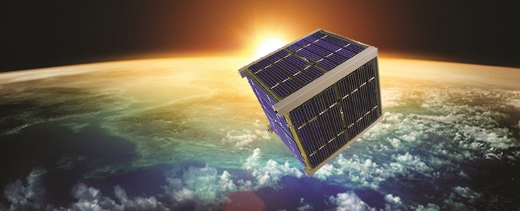

# Table of contents

**Files related to *["Survey of modulation and coding schemes for application in CubeSat systems"](https://ieeexplore.ieee.org/abstract/document/7997514)***:
* [Link Budget](https://github.com/kirlf/cubesats/blob/master/LinkBudget/LB.ipynb)
* [Statistical channel model](https://github.com/kirlf/cubesats/blob/master/statistical_model.md)
* [Modulation and coding \(FEC\)](https://github.com/kirlf/cubesats/blob/master/fec.md)

**Files related to *[Estimation of capabilities of cooperative CubeSat systems based on Alamouti transmission scheme](https://ieeexplore.ieee.org/document/8456940)***:
* [Proposed channel model (Rician) testing](https://nbviewer.jupyter.org/gist/kirlf/4328eb389b3ddc9a0c350eaed468f870)
* [Alamouti test modeling](https://nbviewer.jupyter.org/gist/kirlf/9587c6859db08e5e813b0650f97c7344)

Considered links are contributions to the [teaching materials about MIMO communications](https://github.com/kirlf/CSP/blob/master/MIMO/README.md).

> **NOTE**
>
> The papers mentioned above are just a part of the student projects and therefore all of the numerical results should be reviewed additionally. For example, the mistake may occured in channel modeling (unfortunatelly, the source codes were lost mostly). 

Followink MatLab objects were used for the modeling:
* [comm.PSKModulator](https://www.mathworks.com/help/comm/ref/comm.pskmodulator-system-object.html?s_tid=doc_ta) and [comm.PSKDemodulator](https://www.mathworks.com/help/comm/ref/comm.pskdemodulator-system-object.html)
* [comm.ConvolutionalEncoder](https://www.mathworks.com/help/comm/ref/comm.convolutionalencoder-system-object.html) and [comm.ViterbiDecoder](https://www.mathworks.com/help/comm/ref/comm.viterbidecoder-system-object.html)
* [comm.RSEncoder](https://www.mathworks.com/help/comm/ref/comm.rsencoder-system-object.html?s_tid=doc_ta) and [comm.RSDecoder](https://www.mathworks.com/help/comm/ref/comm.rsdecoder-system-object.html)
* [comm.TurboEncoder](https://www.mathworks.com/help/comm/ref/comm.turboencoder-system-object.html) and [comm.TurboDecoder](https://www.mathworks.com/help/comm/ref/comm.turbodecoder-system-object.html)
* [comm.LDPCEncoder](https://www.mathworks.com/help/comm/ref/comm.ldpcencoder-system-object.html?s_tid=doc_ta) and [comm.LDPCDecoder](https://www.mathworks.com/help/comm/ref/comm.ldpcdecoder-system-object.html?s_tid=doc_ta)
* [comm.OSTBCEncoder](https://www.mathworks.com/help/comm/ref/comm.ostbcencoder-system-object.html?s_tid=doc_ta) and [comm.OSTBCCombiner](https://www.mathworks.com/help/comm/ref/comm.ostbccombiner-system-object.html)

**Extra files:**
* [Optical Link Budget](https://nbviewer.jupyter.org/gist/kirlf/5374c07342521a32e9c25ee8df95697d)
* [Multiple access (short review)](https://github.com/kirlf/cubesats/blob/master/multiple_access.md)

# Introduction

These matherials relate to my Master Thesis [**"Design of cooperative communication system based on CubeSat satellites"**](http://opac.lbs-ilmenau.gbv.de/DB=1/PPN?PPN=898368146) that were completed in August 2017 and developed more deeply during 2017-2018 (as a hobby).

So, I guess it's also necessary to say couple of words about research object - CubeSat satellites. Briefly, it is the type of miniaturized satellites that used primiraly for education and science in the begining of their history \(the standard was developed in 1999\). Nowadays, CubeSats are used in navigation and other commercial applications more and more. We believe, that communication is also branch for CubeSats and therefore we've tried to increase their radiolink capacity during our research. In short, we can mention that theoretically it is possible and prospective.

  
Table 1.1 CubeSat's basic configurations 

| CubeSat format | Dimensions, cm | Mass, kg |
| :--- | :--- | :--- |
| 1U | 10x10x10 | 1.33 |
| 1.5U | 15x10x10 | 2 |
| 2U | 20x10x10 | 2.66 |
| 3U | 30x10x10 | 4 |
| 6U | 30x20x10 | 12 |

Actually, CubeSats are very interesting topic and if you want to learn more you can visit the official site of [The AIAA/USU Conference on Small Satellites](https://digitalcommons.usu.edu/smallsat/) .

Thank you for your attention and you are welcome!

M.Sc. Vladimir Fadeev

December 2017 - February  2019

Kazan
