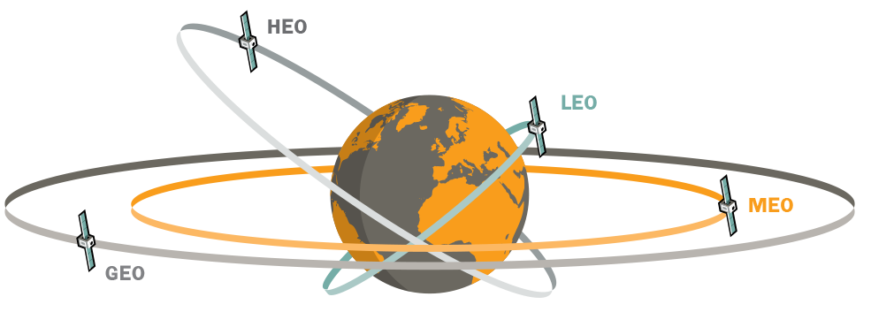
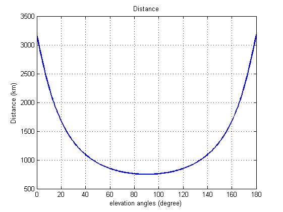
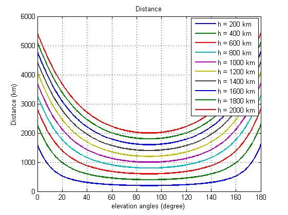
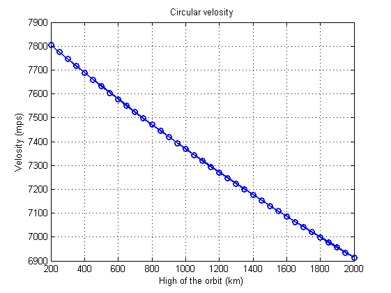

# Link Budget

## 2.1. Main formulas

### 2.1.1. Expected Signal-to-Noise ratio

Before we start considering even different types of modulation it is extremely valuable to know what SNR values can be expected on the receiver side. In fact, we can calculate the SNR as:

$$
SNR  = P_t  + G_t + G_r + \eta_{t} + \eta_{r} - L_r - L_t - L_{add} - L - N  \qquad (1.1)
$$

where $$N$$ is the total termal noise power \(relates to the noise spectral density $$N_0=kT_{noise}$$ and double-sided white noise variance $$\sigma^2=\frac{N_0}{2}$$\) in dBm, $$P_t$$ is the transmitted power in dBm, $$G_t$$ and $$G_r$$ are the antenna gains  on the transmitter and receiver sides respectively \(in dBi\), $$\eta_{t}$$ и $$\eta_{r}$$ are feeder gains in dB, $$L_t$$ and $$L_r$$ are the feeder losses in dB, $$L$$ is the path losses in dB, $$L_{add}$$ is additional losses \(some margin\) in dB.

### 2.1.2. Path loss

Path losses can be estimated by Friis formula:

$$
L = 20lg\frac{\lambda}{4\pi d}[dB] \qquad (1.2)
$$

where $$\lambda$$ \(relates to the carrier frequency $$f_0=\frac{c}{λ}$$, $$c$$ is the speed of electromagnetic wave\) is the wave length and $$d$$ is the distance between satellite and the ground station.

### 2.1.3. Noise power

Noise power can be calculated by:

$$
N = 10lg\left(\frac{kT_{noise}B_{noise}}{10^{-3}}\right) [dBm] \qquad (1.4)
$$

where $$k$$ is the Boltzmann constant, $$T_{noise}$$ is the equivalent noise temperature and $$B_{noise}$$ is the noise bandwidth. According to \[1, p.98\] the noise bandwidth $$B_{noise}$$ can be estimated as $$\gamma B$$, where $$B$$ is the receiver bandwidth and $$\gamma$$ is the constant from 1.002 to 1.57 that relates to configuration of the receiver.

Equivalent noise temperature is not the physical temperature of an antenna. It is equal to the temperature of a resistor, which would have the same thermal noise power in the given frequency band. This parameter can be represented as:

$$
T_{noise} = T_a+T_e \qquad (1.5)
$$

where $$T_a$$ is the sum of antenna losses and sky noise and $$T_e$$ is the receiver noise temperature. Additionally, receiver noise temperature can be calculated by following formula:

$$
T_e=T_0(F_{sys}−1) \qquad (1.6)
$$

where $$T_0$$ is equal to $$290K$$ and $$F_{sys} = 10^{\frac{NF}{10}}$$ is the noise factor which can be estimated by noise figure \($$NF$$\) of the receive antenna.

### 2.1.4. Additional losses

According to \[1, p.88-96\] additional losses include:

* loss due to refraction and inaccuracy of antenna pointing \(Antenna Beam Loss\);
* phase effects in the atmosphere;
* loss due to inconsistency of polarization of antennas;
* attenuations due to hydrometeors.

**Loss due to refraction and inaccuracy of antenna pointing** depends on characteristics of the certain antenna:

$$
L_b = 10log_{10}(1+ (2\theta/\theta_{0.5})^2) \qquad (1.7)
$$

where $$ \theta$$ is the beamwidth and $$\theta_{0.5}$$ is the halfpowered beamwidth \(fig. 2.1\).

 

![Fig. 2.1 Antenna gain pattern  \[2\]](.gitbook/assets/image%20%288%29.png)

According to [\[2\]](http://www.atlantarf.com/Downloads.php) total antenna losses for large cassegrain antennas are equal to 1.65 dB.

**Phase effects in the atmosphere** influence data rate, due to receiver bandwidth should be desirably selected according to table 2.1 \[1, p. 91\] to avoid phase distortions.

Table 2.1 Maximum receiver bandwidths for different ranges.

| Carrier frequency, GHz | 0.5 | 1 | 5 | 10 |
| :--- | :--- | :--- | :--- | :--- |
| Receiver bandwidth \(B\), MHz | 10 | 25 | 270 | 750 |

Additionaly, to avoid Faradey effect for ranges less than 10 GHz only circular polarization should be used \[1, p. 91\].

**Loss due to inconsistency of polarization of antennas** can be estimated by figure 2.2 \($$e_1$$ and $$e_2$$ are coefficients of elipticity\).


![Fig. 2.2. Dependence of losses due to inconsistency of the polarizations of the transmitting and receiving antennas from the polarity elepticity. \[1, p. 93\]](.gitbook/assets/image%20%287%29.png)

In general, this parameter is kind of reference data, e.g. in the link budget calculation for [NanoCom AX100](https://gomspace.com/UserFiles/Subsystems/datasheet/gs-ds-nanocom-ax100-33.pdf) polarization losses are equal to 3 dB \(and athmospheric losses are 2.1 dB,  ionospheric losses are 0.4 dB\).

**Attenuations due to hydrometeors and other additional losses** can be evaluated by [\[10\]](https://www.itu.int/dms_pubrec/itu-r/rec/p/R-REC-P.676-11-201609-I!!PDF-E.pdf). Fortunately, for ranges smaller than 10 GHz the losses are smaller than 1 dB \(fig. 2.3 and 2.4\).

![Fig. 2.3:  Specific attenuation due to atmospheric gases, calculated at 1 GHz intervals, including line centres \[10\].](.gitbook/assets/atten1.png)


![Fig.  2.4:  Zenith attenuation due to atmospheric gases, calculated at 1 GHz intervals, including line centres \[10\].](.gitbook/assets/atten2.png)

### 2.1.4. Summary

Let us provide some parameters summary:

1. **Initial point:** carrier frequency,  hight of the orbit;
2. **Equipment dependent parameters \(adjustable\)**: transmitted power , receiver bandwidth ;
3. **Reference data:** antenna gains and losses, feeder gains and losses , ****noise temperature,  additional losses.

## 2.2. Considered equipment

In fact, we use informstion about common example of ground station such as IC-910H [\[3\] ](http://sicom.ru/catalog/radiostancii/lyubitelskie/bazovye/icom-ic-9100.html)or ISIS ground station[ \[4\] ](https://www.cubesatshop.com/product/full-ground-station-kit-vhfuhfs-band/)however we can estimate some parameter of mobile stations of real space communication systems also. Fortunately, a lot of this information is open and available on official sites [\[5\]](https://www.iridium.com%20), [\[6\],](https://www.globalstar.com) [\[7\]](http://www.gonets.ru/rus/%20).

These parameters can be used for calculation of up-link link budget.

For down-link estimation real example of CubeSat transceivers such as NanoCom AX100 [\[8\]](https://gomspace.com/Shop/subsystems/communication/nanocom-ant2000.aspx) \(fig. 2.6\) may be used. Additionally, as an example of CubeSat UHF/VHF antenna omnidirectional NanoCom ANT430 \(fig. 2.5\) can be considered [\[9\]](https://gomspace.com/Shop/subsystems/communication/nanocom-ant430.aspx).


For larger possible bandwidth 2.4GHz range also should be considered. For this range patch-antenna NanoCom ANT2000 and S-band transceiver NanoCom SR2000 are available[ \[10\]](https://gomspace.com/Shop/subsystems/communication/nanocom-sr2000.aspx) \(fig. 2.7\). For low speed transmission \(for example, for signaling\) UHF/VHF NanoCom ANT430 [\[11\]](https://gomspace.com/Shop/subsystems/communication/nanocom-ax100.aspx) \(fig. 2.8\) can be used.


## 2.4 Results

### 2.4.1. Primary consideration

Results for distance between satellite and ground station that was fixed in value that is equal to height of the orbit $$h$$ are shown in the tables 2.2-2.4 of the following pdf-file:




### 2.4.2. Sat-to-Ground distance

  More precise calculation of the distances in dependance of elevation angles $$\phi$$ can be provided according to [\[12\]](https://ieeexplore.ieee.org/document/7506756/) for orbit geometries that are shown in fig. 2.8 and 2.9:

$$
d = \sqrt{(R_E+h)^2-R^2cos^2\phi} - R_Esin\phi \qquad (1.8)
$$

 where __$$R_E$$ is the Earth radius.





![Fig. 2.9.  Schematic description of a CubeSat trajectory in low Earth orbit \[12\].](.gitbook/assets/cubetrraj.png)

  
For orbit's altitude 750 km results are shown in fig. 2.10.



For different LEO altitudes results are shown in fig. 2.11.



  
Moreover, the range  between minimum and maximum distances can be calculated with respect to geographical coordinates of the ground station \($$lat_{gs}$$ and $$long_{gs}$$\) and the instantaneous ascending node $$L_{node}$$and the instantaneous orbit pole $$i$$ of the satellite \[13, p.110-123\].

$$
d_{min} = R_E\frac{\sin \lambda_{min}}{\sin \eta_{min}} \qquad (1.9)
$$

where $$\sin \lambda_{min} = \sin(90^0 - i)\sin (lat_{gs}) + \cos(90^0 - i)\cos (lat_{gs}) \cos(long_{gs}- (L_{node} - 90^0)) $$ is the minimum Erth central angle. Minimum nadir angle can be calculated as:

$$
\eta_{min} = arctan \frac{\sin \rho \sin \lambda_{min}}{1 - \sin \rho \cos \lambda_{min}} \qquad(1.10)
$$

where $$ \rho = arcsin \frac{R_E}{R_E+h}$$  is the angular radius of the Earth. 

Maximum distance can be calculated by:

$$
d_{max} = R_E \frac{\sin \lambda_{max}}{\sin \eta_{max}} \qquad(1.11)
$$

where $$\sin \eta_{max} = \sin \rho \cos \epsilon_{min}$$  and $$ \lambda_{max} = 90^0 - \epsilon_{min} - \eta_{max}$$ \($$\epsilon_{min}$$ is the minimum spacecraft elevation\).

| $$h$$\(km\) | $$ d_{min}$$\(km\) | $$d_{max}$$\(km\) |
| :--- | :--- | :--- |
| 750 | 1867.5 | 2671.6 |

### 2.4.3. Python script

```python
class LinkBudget:
    def __init__(self, h, mode, L_node = None, incl = None, lat_gs = None, long_gs = None, eps_min = 0):
        self.h = h
        self.mode = mode
        if mode == 'precise':
            if L_node == None:
                L_node = float(input('Print  different for distinct passes of the satellite over the ground station (L_node) in degrees: '))
            self.lat_pole = 90 - incl
            if incl == None:
                incl = float(input('Print  orbit inclination (incl) in degrees: '))
            self.long_pole = L_node - 90
            if lat_gs == None:
                self.lat_gs = float(input('Print latitude of the ground station (lat_gs) in degrees: '))
            else:
                self.lat_gs = lat_gs
            if long_gs == None:
                self.long_gs = float(input('Print longtitude of the ground station (long_gs) in degrees: '))
            else:
                self.long_gs = long_gs
            self.eps_min = eps_min
    
    def distance(self):
        R_E = 6356863
        if self.mode == 'draft':
            phi = np.pi*np.array(range(0,181,5))/180
            d = np.array(np.sqrt((R_E+self.h)**2 - (R_E**2)*np.cos(phi)**2) - R_E*np.sin(phi))
        else:
            #coordinates
            lat_pole = self.lat_pole*np.pi/180
            long_pole = self.long_pole*np.pi/180
            lat_gs = self.lat_gs*np.pi/180
            long_gs = self.long_gs*np.pi/180
            eps_min = self.eps_min*np.pi/180
            delta_l = (self.long_gs - self.long_pole)*np.pi/180
            #minimum distance
            sin_lambda_min = np.sin(lat_pole)*np.sin(lat_gs) + np.cos(lat_pole)*np.cos(lat_gs)*np.cos(delta_l)
            self.lambda_min = np.arcsin(sin_lambda_min)
            sin_rho = R_E /(R_E+self.h)
            cos_lambda_min = np.cos(np.arcsin(sin_lambda_min)) 
            tan_eta_min = sin_rho*sin_lambda_min / (1 - sin_rho*cos_lambda_min)
            sin_eta_min = np.sin(np.arctan(tan_eta_min))
            dmin = (R_E)*(sin_lambda_min/sin_eta_min)
            #maximum distance 
            sin_eta_max = sin_rho*np.cos(eps_min)
            lambda_max = np.pi/2 - eps_min - np.arcsin(sin_eta_max)
            self.lambda_max = lambda_max
            dmax = R_E*(np.sin(lambda_max)/sin_eta_max)            
            d = np.array(range(int(np.round(dmin)),int(np.round(dmax))))
        return d
                
    def path_loss(self, f0):
        c = 3*1e8 #electromagnetic wave speed
        R_E = 6356863
        lambd = c/f0
        d = self.distance()
        L = 4*np.pi*d/lambd
        return 20*np.log10(L)
    
    def received_power(self, Pt, f0, Gt, Gr, eta_t=0, eta_r = 0, Lt=0, Lr=0, Ladd=5):
        Lpl = self.path_loss(f0)
        Pr = 10*np.log10(Pt*1e3) + Gt + Gr + eta_t + eta_r - Lt - Lr - Lpl - Ladd
        return Pr
    
    def noise_power(self, B, Tnoise, gamma = 1):
        k = 1.38064852*1e-23 #Bolzman constant
        N = k*B*gamma*Tnoise
        return 10*np.log10(N*1e3)
        
    def expected_snr(self, f0, Pt, Gt, Gr, B, Tnoise, eta_t = 0, eta_r = 0, Lt=0, Lr=0, Ladd = 5, gamma=1):
        EIRP = 10*np.log10(Pt*1e3) + Gt
        Pr = self.received_power(Pt, f0, Gt, Gr, eta_t, eta_r, Lt, Lr, Ladd)
        N = self.noise_power(B, Tnoise, gamma)
        snr = Pr - N
        return snr, EIRP
        
    def visibility_time(self):
        if self.mode == 'precise':
            self.distance()
            P = 1.658669e-4*((6378.14 + self.h*1e-3)**1.5)
            T = (P/np.pi)*np.arccos(np.cos(self.lambda_max)/np.cos(self.lambda_min))
        elif self.mode == 'draft':
            R_E = 6356863
            v = np.sqrt(6.67e-11*6e24/(R_E + self.h))
            T = (2*(R_E + self.h)*np.arccos(R_E/(R_E + self.h)) / v)/60
        else:
            print('Wrong mode.')
        return T 
```

### 2.4.4. Visibility time

Moreover, if we assume that we consider environment without any influence of the atmosphere to the movement of the satellite, circular velocity can be calculated via the classical way \(fig. 2.12\):

$$
v = \sqrt{G\frac{M}{R}} \qquad (1.12)
$$

 where $$G=6.67 \times 10^{-11} m^3 \times kg^{-1} \times s^{-2}$$  is the Gravity constant, $$M = 6\times 10^{24} kg$$  is the Earth mass and $$R = R_E + h$$  is the orbit radius \(Earth radius plus orbit heigh\).



 Visibility time can be calculated based on knowledge about circular velocity and heigh of the orbit. For trajectory that is shown in fig. 2.8 and 2.9 this can be done via [\[12\]](https://ieeexplore.ieee.org/document/7506756/):

$$
t=\frac{2(R_E+h)arccos(\frac{R_E}{R_E+h})}{v}
\qquad (1.13)
$$

More precise calculation can be done by \[13, p.121\]:

$$
t = \frac{P}{180^0}\arccos \left( \frac{\cos \lambda_{max}}{\cos \lambda_{min}} \right) \qquad (1.14)
$$

where $$ P = 1.658669 \times 10^{-4} \times  (6378.14 + h[km])^{3/2} $$  is the orbit period \(in minutes\).


Results are shown in table 2.2

#### Table 2.2 Visibility time of CubeSats

| **Hight of the orbit \(km\)** | **Visibility time \(min\) formula 1.13** | **Visibility time \(min\) formula 1.14 \(**$$ lat_{pole} = 61.5^0$$, $$ long_{pole} = 100^0$$, $$ lat_{gs} = 22^0$$, $$long_{gs} = 200^0$$, $$ \epsilon_{min} = 5^0$$**\)** |
| :--- | :--- | :--- |
| 200 | 6.9 | 0 |
| 250 | 7.8 | 0 |
| 300 | 8.6 | 0 |
| 350 | 9.4 | 0 |
| 400 | 10.1 | 2.5 |
| 450 | 10.8 | 4.0 |
| 500 | 11.5 | 5.2 |
| 550 | 12.1 | 6.1 |
| 600 | 12.8 | 6.97 |
| 650 | 13.4 | 7.8 |
| 700 | 14 | 8.5 |
| 750 | 14.7 | 9.2 |
| 800 | 15.3 | 9.9 |
| 850 | 15.8 | 10.5 |
| 900 | 16.4 | 11.2 |
| 950 | 17 | 11.8 |
| 1000 | 17.6 | 12.4 |
| 1050 | 18.1 | 13.0 |
| 1100 | 18.7 | 13.6 |
| 1150 | 19.3 | 14.2 |
| 1200 | 19.8 | 14.7 |
| 1250 | 20.4 | 15.3 |
| 1300 | 20.9 | 15.8 |
| 1350 | 21.5 | 16.4 |
| 1400 | 22 | 16.9 |
| 1450 | 22.6 | 17.5 |
| 1500 | 23.1 | 18.0 |
| 1550 | 23.6 | 18.6 |
| 1600 | 24.2 | 19.1 |
| 1650 | 24.7 | 19.6 |
| 1700 | 25.3 | 20.2 |
| 1750 | 25.8 | 20.7 |
| 1800 | 26.3 | 21.2 |
| 1850 | 26.9 | 21.7 |
| 1900 | 27.4 | 22.3 |
| 1950 | 27.9 | 22.8 |
| 2000 | 28.5 | 23.3 |


##  References

\[1\] L. Kantor, Satellite communication and broadcasting. Directory,Radio and communication,1988, 

\[2\]  Antennas - An Overview [http://www.atlantarf.com/Downloads.php](http://www.atlantarf.com/Downloads.php)  \(date of the application is 09.07.2018\)

\[3\] IC-910H specification[ ](http://sicom.ru/catalog/radiostancii/lyubitelskie/bazovye/icom-ic-9100.html)                                       [http://sicom.ru/catalog/radiostancii/lyubitelskie/bazovye/icom-ic-9100.html](http://sicom.ru/catalog/radiostancii/lyubitelskie/bazovye/icom-ic-9100.html) \(date of the application is 27.06.2018\)

\[4\] ISIS CubeSate equipment technical specification                                                     [https://www.cubesatshop.com/product/full-ground-station-kit-vhfuhfs-band/](https://www.cubesatshop.com/product/full-ground-station-kit-vhfuhfs-band/) \(date of the application is 27.06.2018\)

\[5\] Official web-site of Iridium company                                                                                   [https://www.iridium.com](https://www.iridium.com/) \(date of the application is  27.06.2018\)

\[6\] Official web-site of Globstar company                                                                             [https://www.globalstar.com](https://www.globalstar.com/) \(date of the application is  27.06.2018\)

\[7\] Official web-site of Messenger company                                                                   [http://www.gonets.ru/rus/](http://www.gonets.ru/rus/) \(date of the application is  27.06.2018\)

\[8\] S-band patch antenna for high speed communication  by GomSpace company [https://gomspace.com/Shop/subsystems/communication/nanocom-ant2000.aspx](https://gomspace.com/Shop/subsystems/communication/nanocom-ant2000.aspx) \(date of the application is 27.06.2018\)

\[9\] Omnidirectional canted turnstile UHF antenna system by GomSpace company[https://gomspace.com/Shop/subsystems/communication/nanocom-ant430.aspx](https://gomspace.com/Shop/subsystems/communication/nanocom-ant430.aspx) \(date of the application is 27.06.2018\)

\[10\]  Flexible High Speed S-Band Radio Transceiver by GomSpace company [https://gomspace.com/Shop/subsystems/communication/nanocom-sr2000.aspx](https://gomspace.com/Shop/subsystems/communication/nanocom-sr2000.aspx) \(date of the application is  27.06.2018\)

\[11\] Flexible and Miniaturised Transceiver  by GomSpace company [https://gomspace.com/Shop/subsystems/communication/nanocom-ax100.aspx](https://gomspace.com/Shop/subsystems/communication/nanocom-ax100.aspx) \(date of the application is 27.06.2018\)

\[10\] Attenuation by atmospheric gases, ITU 2016                                         [https://www.itu.int/dms\_pubrec/itu-r/rec/p/R-REC-P.676-11-201609-I!!PDF-E.pdf](https://www.itu.int/dms_pubrec/itu-r/rec/p/R-REC-P.676-11-201609-I!!PDF-E.pdf) \(date of the application is 27.06.2017\)

\[12\] Otilia Popescuy, Jason S. Harrisz and Dimitrie C. Popescuz, Designing the Communica- tion Sub-System for Nanosatellite CubeSat Missions: Operational and Implementation Perspectives, 2016, IEEE

  
\[13\]  Wertz J. R., Larson W. J. Space Mission Analysis and Design, Space Technology Library. – Microcosm Press and Kluwer Academic Publishers, El Segundo, CA, USA,, 1999.

